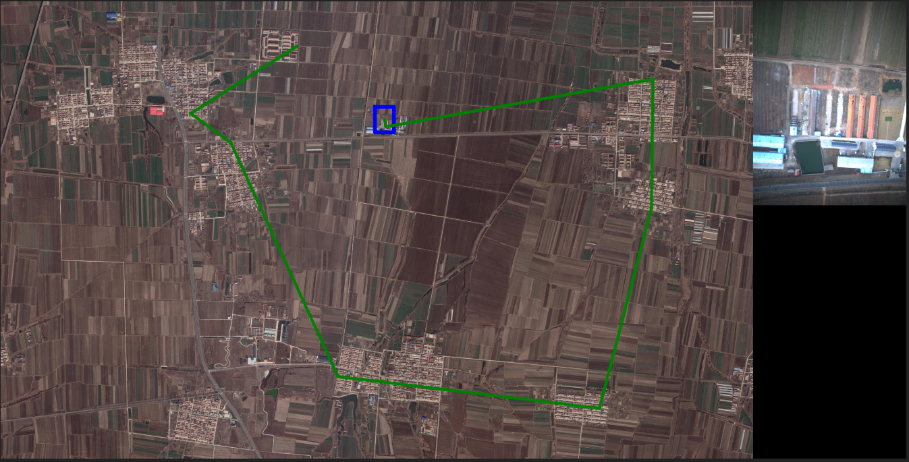
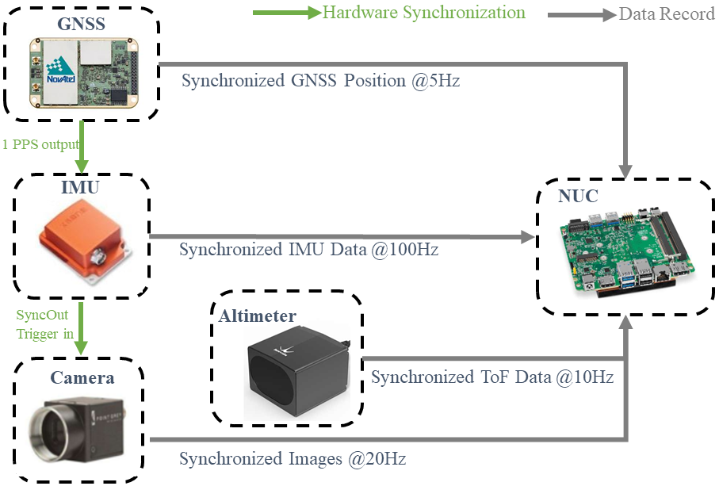
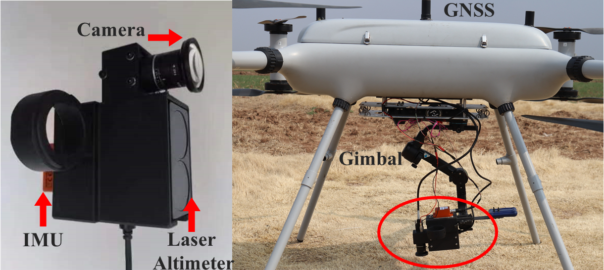

# AerialVL Dataset

**AerialVL is a visual localization dataset designed for aerial-based Vehicles.**
---

  <a href="#dataset">Dataset</a> •
  <a href="#code">Code</a> •
  <a href="#citation">Citation</a> •
  <a href="#license">License</a>

  

## Dataset

### Description

- About 70km flight data with various terrian, multi-height and illumination changes.
- 11 flight sequences with different routes ranging from the shortest one of 3.7km to the longest up to 11km.
- 18361 separate aerial-based images with 14096 cropped corresponding map patches.
- Adequate evaluations on VPR, VAL and VO to serve as the baselines for aerial vehicles.
- All samples include high-res images, IMU, and GNSS tag.

### Sensor Setup

  

  

| **Sensor**    | **Details**                                                  |
| ------------- | ------------------------------------------------------------ |
| **Camera**    | FLIR BFS-U3-31S4C-C; RGB channels, 2048×1536 resolution, 55Hz max frame rate (20Hz in experiment), global shutter |
| **Lens**      | Chiopt FA0401C; 82.9 horizontal FOV, 66.5 vertical FOV, 4∼75mm focal length |
| **IMU**       | Xsens MTi-30-2A8G4; 200Hz update with acceleration and angular velocity |
| **GNSS**      | NovAtel OEM718D; dual-antenna, 5Hz update, 1.5m (RMS) with single point, 1cm + 1ppm (RMS) with RTK |
| **Altimeter** | Benewake TF350; 10Hz update, 350m maximum detection range with 0.1m accuracy |

## Code
Code for VPR is mainly inspired the evaulations given in [DVGL Benchmark](https://github.com/gmberton/deep-visual-geo-localization-benchmark).
And we add some re-rank methods and re-implement it for the AerialVL dataset.
The full code is coming soon.

## Citation
The paper as well as the full dataset will be released after the review process completing.

## License
[GPLv3](http://www.gnu.org/licenses/) license.

